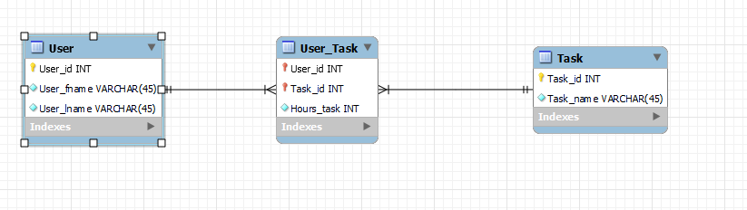

# Task Manager

``` What I want to do with this program was to keep track of users task. Did a user spend 10 hours on homework or not. Did not know how to impletement MySQL into it so I switch to SQLite.```


[Software Demo Video](https://www.youtube.com/watch?v=tZTRbMT3fDI)

##### Files to install:
* pysqlite3
* SQLite (extension by alexcvzz)

# Relational Database

```I am using SQLite. I made a basic diagram using mySQL workbench ```

```There are 3 tables. User which keeps tracks of the users, Task which saves all the unique task you want, and User_Task which combines both and keeps track on how long you've been doing a task.```

# Development Environment
* Python 3.9.12
* VsCode
* SQLite

# Useful Websites
* [YouTube](https://www.youtube.com/watch?v=IBgWKTaG_Bs)
* [Datacarpentry](https://datacarpentry.org/python-ecology-lesson/09-working-with-sql/index.html)
* [StackOverFlow](https://stackoverflow.com/questions/19530974/how-can-i-add-the-sqlite3-module-to-python)


# Future Work
* Implement Better Visuals
* Link it to a website
* Put it into a mySQL database instead of SQLite
